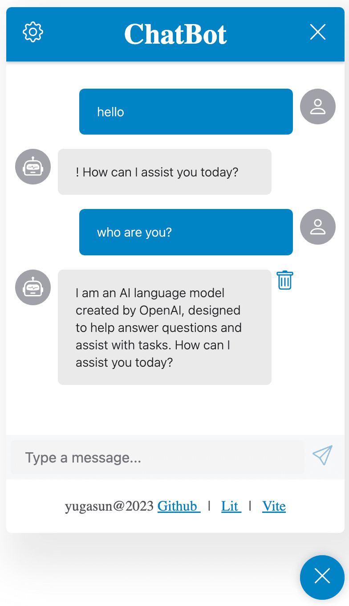

# ChatBot

[](https://www.npmjs.com/)

[](https://lit.dev/)
[](https://www.typescriptlang.org/)
[](https://vitejs.dev)
[](https://github.com/yugasun/chatbot/actions/workflows/deploy.yml)

ChatBot is a chat robot that simplifies the usage of chat GPT tools like ChatGPT, and can be integrated into any framework (e.g., Vue, React, Angular) for easy implementation.

## Feature

-   [x] 🚀 Can be used in any framework, such as Vue, React, Angular, etc.
-   [x] 🌟 Works with CDNs
-   [x] 🎨 Customizable style
-   [x] 🍺 Type safe with TypeScript
-   [ ] 🌍 I18n ready

## Demo

[Live Demo](https://chatbot-yugasun.vercel.app/)



## Usage

### For framework use (Vue, React, Angular, etc.)

Install

```bash
pnpm install @yugasun/chatbot
```

Then import it in entry file:

```js
import '@yugasun/chatbot';
```

For Vue, refer to: [Vue Demo](./demo/vue)
For React, refer to: [React Demo](./demo/react)

To enable stream mode, you need to add the `stream` attribute to the `chat-bot` tag.

```html
<chat-bot stream></chat-bot>
```

### For pure HTML use

```html
<!DOCTYPE html>
<html lang="en">
    <head>
        <meta charset="UTF-8" />
        <title>ChatBot</title>
        <script
            type="module"
            src="https://cdn.skypack.dev/@yugasun/chatbot"
        ></script>
    </head>
    <body>
        <chat-bot></chat-bot>
    </body>
</html>
```

## Develop

```bash
# 0. Clone project
git clone https://github.com/yugasun/chatbot

# 1. Install dependencies
pnpm install

# 2. Start develop server
pnpm dev

# 3. Build
pnpm build
```

## License

[MIT @yugasun](./LICENSE)
