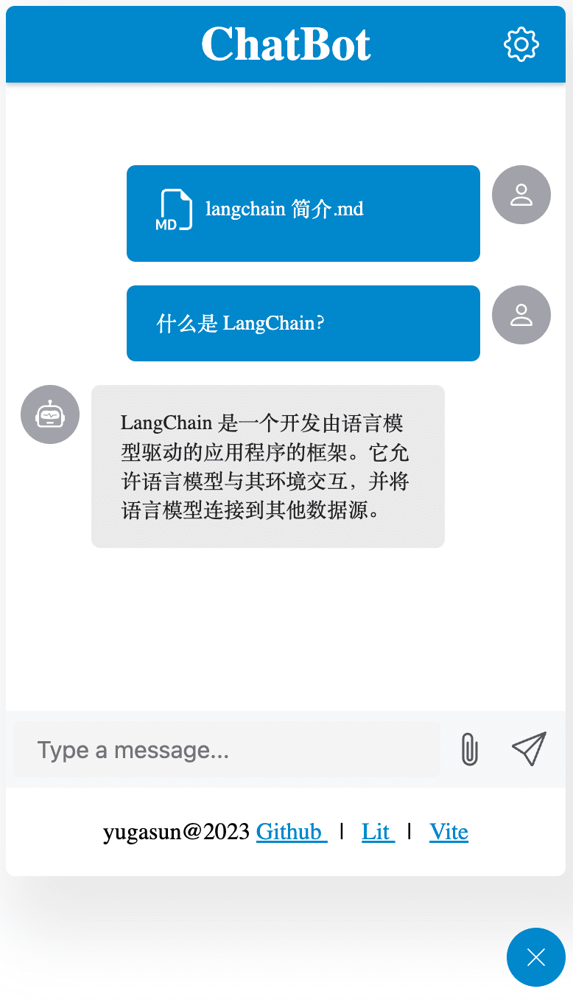

# ChatBot

[](https://lit.dev/)
[](https://www.typescriptlang.org/)
[](https://vitejs.dev)
[](https://github.com/yugasun/chatbot/actions/workflows/deploy.yml)

ChatBot is a chat robot, developed with Lit Element. It's very easy to use, just add a script tag to your html file, and then you can use it.

## Feature

-   [x] [Lit Element](https://lit.dev/)
-   [x] 🌟 [Shoelace Web components](https://shoelace.style/)
-   [x] [TypeScript](https://www.typescriptlang.org/)
-   [x] [Vite](https://vitejs.dev/) Next Generation Frontend Tooling
-   [ ] 🎨 [UnoCSS](https://github.com/antfu/unocss) - the instant on-demand atomic CSS engine (**Need bugfix for build version**)
-   [ ] 🌍 I18n ready
-   [x] [ESLint](https://eslint.org/)
-   [x] [Prettier](https://prettier.io/)
-   [x] [Airbnb Style Guide](https://github.com/airbnb/javascript)
-   [x] [Commitlint](https://github.com/conventional-changelog/commitlint) Lint commit messages
-   [x] [Commitizen](https://github.com/commitizen/cz-cli) The commitizen command line utility.

## Demo

[Live Demo](https://chatbot.yugasun.com/)



## Usage

Install

```bash
pnpm install @yugasun/chatbot
```

For use in Vue, refer to: https://vuejs.org/guide/extras/web-components.html

```js
import '@yugasun/chatbot';
```

Then use it in vue template:

```html
<chat-bot></chat-bot>
```

To enable stream mode, you need to add the `stream` attribute to the `chat-bot` tag.

```html
<chat-bot stream></chat-bot>
```

## Develop

```bash
# 0. Clone project
git clone https://github.com/yugasun/chatbot

# 1. Install dependencies
pnpm install

# 2. Start develop server
pnpm dev

# 3. Build
pnpm build
```

## License

[MIT @yugasun](./LICENSE)
